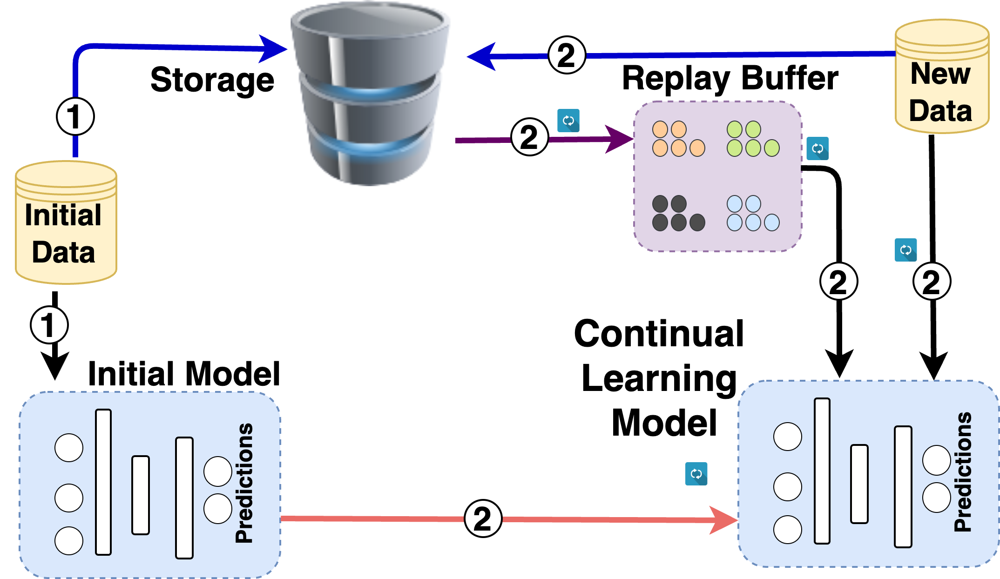
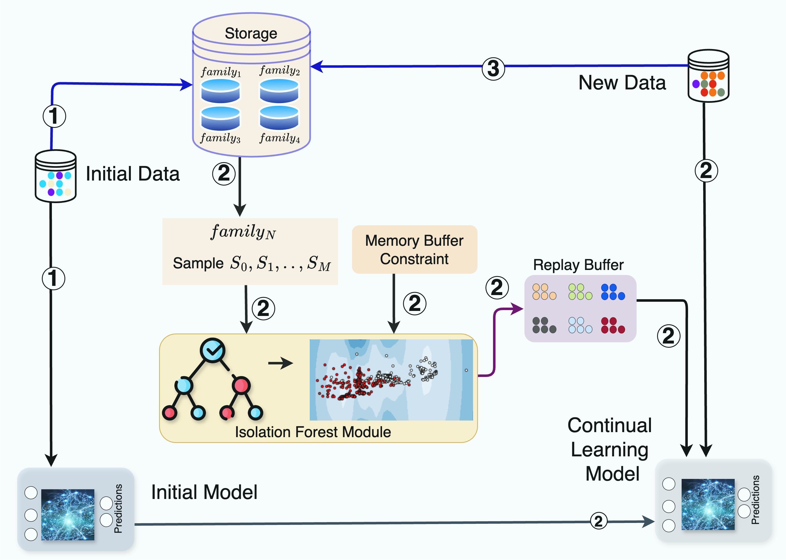
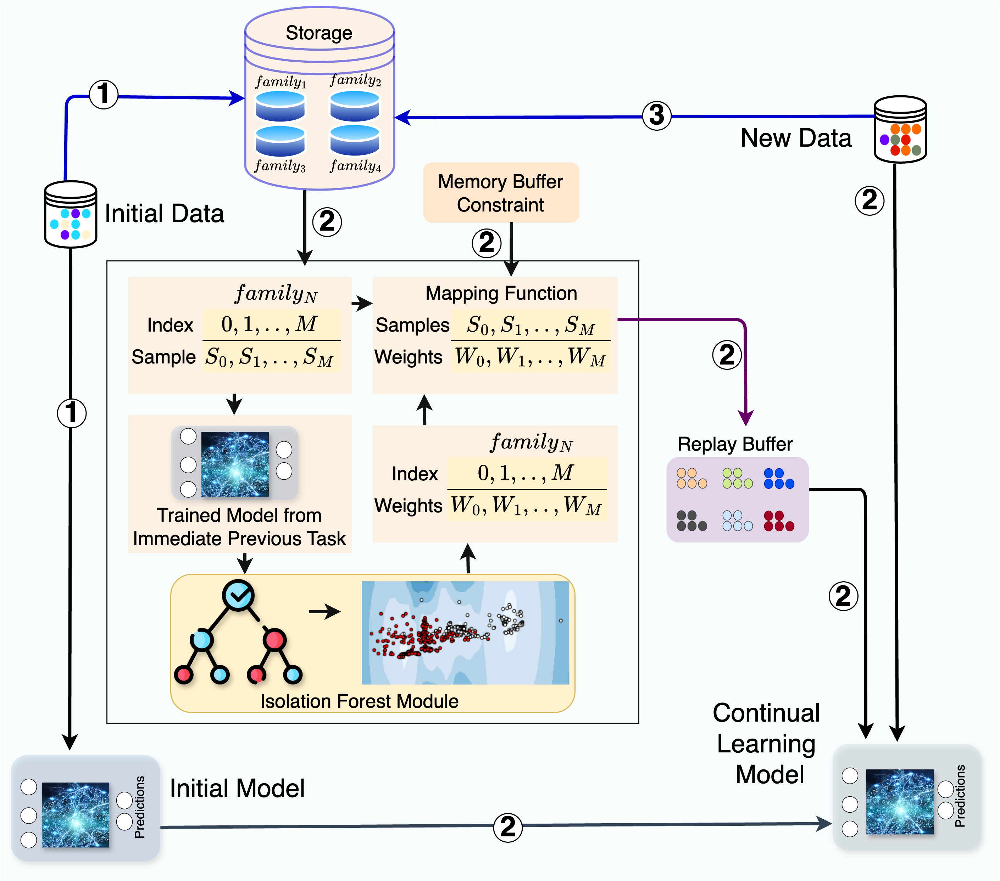
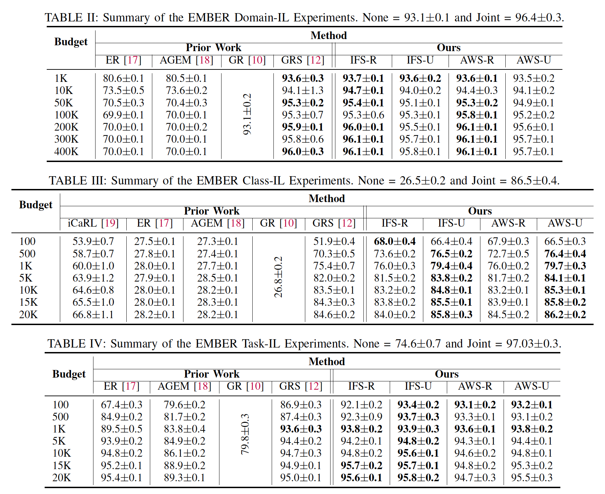
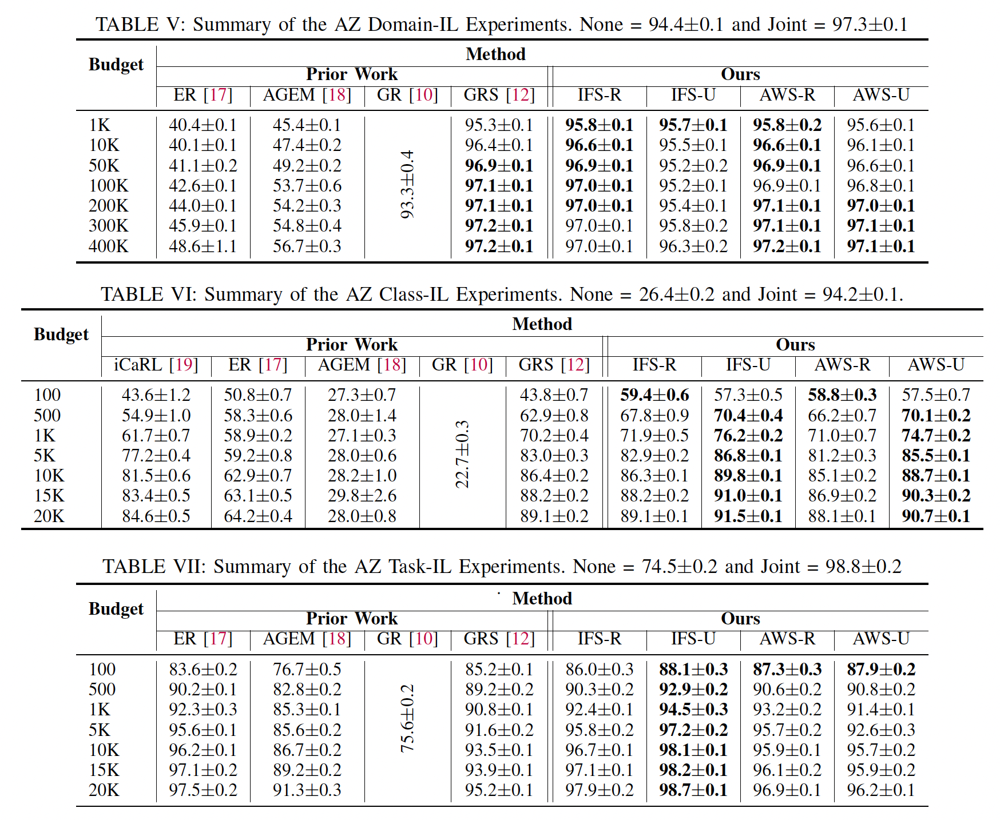

# MADAR: Efficient Continual Learning for Malware Analysis with Diversity-Aware Replay

``This repository contains the code and the datasets for a submitted paper in a conference.``


## Dependencies & Required Packages

Please make sure you have all the dependencies available and installed.

- NVIDIA GPU
- CentOS Linux 7/Ubuntu 22.04
- Python3-venv/ conda
- CUDA Version: 12.2 
- Python Version: 3.9.X

-- Please install the required packages using the following command:
`pip install -r requirements.txt`

We suggest the users to create a `python virtual environment` or `conda environment` and install the required packages.

```
conda create -n MADAR python=3.9
conda activate MADAR
conda install numpy=1.25.2
conda install pytorch=2.0.1 torchvision=0.15.2 cudatoolkit=12.2 -c pytorch
```

Alternatively, you can use the exact `conda environment` that we have used for our experiments. 
1. Create the environment from the environment.yml file:
    ``conda env create -f environment.yml``
    
2. Activate the new environment: ``conda activate MADAR``

3. Verify that the new environment was installed correctly: ``conda env list``


## Datasets

### EMBER

For EMBER experiments, we have used the dataset provided by Rahman et al. [1].

### AZ

Our collected AZ datasets can be downloaded from ``AZ_Datasets`` directory. The directory contains two datasets.

- `AZ_Domain.tar.bz2` is referred as AZ-Domain for AZ Domain-IL experiments in the paper.
- `AZ_Family.tar.bz2` is referred as AZ-Class for AZ Class-IL and AZ Task-IL experiments in the paper.

Please note that, these datasets are collected as ``.apk`` files from AndroZoo repository [2]. Then Drebin [3] features are extracted from the ``.apk`` files. Finally the features are standardized using ``standard scaler`` and these final datasets are used to run all the experiments in the paper.


## Replay-based Continual Learning

<div style="text-align: center;">
    
</div>


## Isolation Forest-based Sampling (IFS)


<div style="text-align: center;">
    
</div>


## Anomalous Weights-based Sampling (AWS)

<div style="text-align: center;">
    
</div>


## EMBER Experiments


<div style="text-align: center;">
    
</div>


### EMBER Domain

1. GRS experiments: run ``python GRS.py --memory_budget=${MEMORY_BUDGET}``
2. MADAR IFS experiments: run ``python MADAR_IFS.py --ifs_option=${IFS_OPTION} --memory_budget=${MEMORY_BUDGET}``
3. MADAR AWS experiments: run ``python MADAR_AWS.py --ifs_option=${IFS_OPTION} --memory_budget=${MEMORY_BUDGET}``

### EMBER Class


1. GRS experiments: run ``python main.py --metrics --scenario=class --replay_config=${REPLAY_CONFIG} --memory_budget=${MEMORY_BUDGET}``

2. MADAR IFS experiments: run ``python main.py --metrics --scenario=class --replay_config=ifs --ifs_option=${IFS_OPTION} --memory_budget=${MEMORY_BUDGET}``

3. MADAR AWS experiments: run ``python main.py --metrics --scenario=class --replay_config=aws --ifs_option=${IFS_OPTION} --memory_budget=${MEMORY_BUDGET}``


### EMBER Task

1. GRS experiments: run ``python main.py --metrics --scenario=task --replay_config=${REPLAY_CONFIG} --memory_budget=${MEMORY_BUDGET}``

2. MADAR IFS experiments: run ``python main.py --metrics --scenario=task --replay_config=ifs --ifs_option=${IFS_OPTION} --memory_budget=${MEMORY_BUDGET}``

3. MADAR AWS experiments: run ``python main.py --metrics --scenario=task --replay_config=aws --ifs_option=${IFS_OPTION} --memory_budget=${MEMORY_BUDGET}``


## AZ Experiments


<div style="text-align: center;">
    
</div>


### AZ Domain

1. GRS experiments: run ``python GRS.py --memory_budget=${MEMORY_BUDGET}``
2. MADAR IFS experiments: run ``python MADAR_IFS.py --ifs_option=${IFS_OPTION} --memory_budget=${MEMORY_BUDGET}``
3. MADAR AWS experiments: run ``python MADAR_AWS.py --ifs_option=${IFS_OPTION} --memory_budget=${MEMORY_BUDGET}``

### AZ Class

1. GRS experiments: run ``python main.py --metrics --scenario=class --replay_config=${REPLAY_CONFIG} --memory_budget=${MEMORY_BUDGET}``

2. MADAR IFS experiments: run ``python main.py --metrics --scenario=class --replay_config=ifs --ifs_option=${IFS_OPTION} --memory_budget=${MEMORY_BUDGET}``

3. MADAR AWS experiments: run ``python main.py --metrics --scenario=class --replay_config=aws --ifs_option=${IFS_OPTION} --memory_budget=${MEMORY_BUDGET}``


### AZ Task

1. GRS experiments: run ``python main.py --metrics --scenario=task --replay_config=${REPLAY_CONFIG} --memory_budget=${MEMORY_BUDGET}``

2. MADAR IFS experiments: run ``python main.py --metrics --scenario=task --replay_config=ifs --ifs_option=${IFS_OPTION} --memory_budget=${MEMORY_BUDGET}``

3. MADAR AWS experiments: run ``python main.py --metrics --scenario=task --replay_config=aws --ifs_option=${IFS_OPTION} --memory_budget=${MEMORY_BUDGET}``


__________________________
#### References
```angular2
[1] Rahman, Mohammad Saidur, Scott Coull, and Matthew Wright. 
"On the limitations of continual learning for malware classification." 
In Conference on Lifelong Learning Agents, pp. 564-582. PMLR, 2022.

[2] Allix, Kevin, Tegawendé F. Bissyandé, Jacques Klein, and Yves Le Traon. 
"Androzoo: Collecting millions of android apps for the research community." 
In Proceedings of the 13th international conference on mining software repositories, pp. 468-471. 2016.

[3] Arp, Daniel, Michael Spreitzenbarth, Malte Hubner, Hugo Gascon, Konrad Rieck, and C. E. R. T. Siemens. 
"Drebin: Effective and explainable detection of android malware in your pocket." 
In NDSS, vol. 14, pp. 23-26. 2014.

```