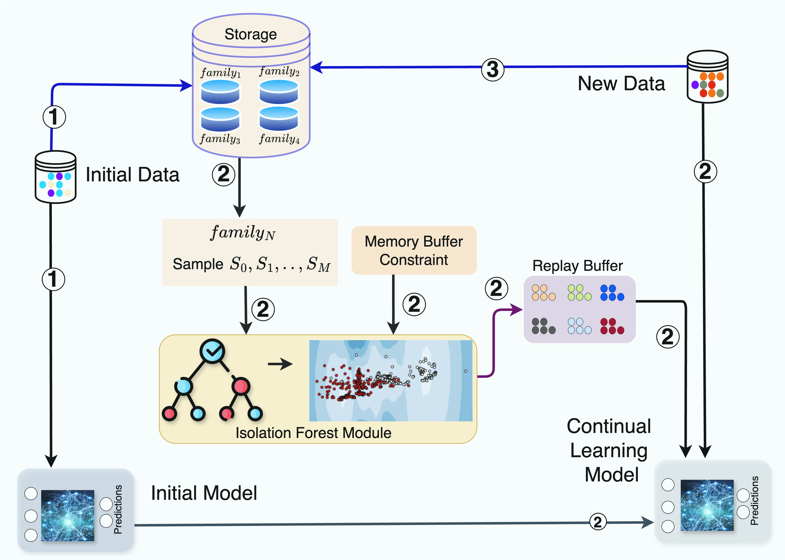
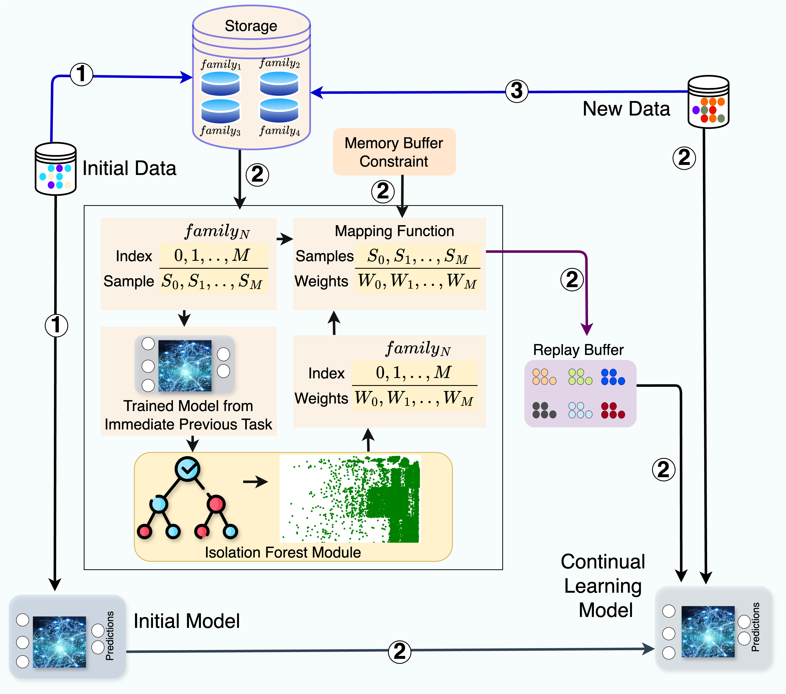

# MADAR: Efficient Continual Learning for Malware Analysis with Diversity-Aware Replay

``This is a submitted paper to a conference and is currently under review. This repository contains the code and the datasets for this submitted paper.''


## Dependencies & Required Packages

Please make sure you have all the dependencies available and installed.

- NVIDIA GPU
- CentOS Linux 7/Ubuntu 22.04
- Python3-venv/ conda
- CUDA Version: 12.2 
- Python Version: 3.9.X

-- Please install the required packages using the following command:
`pip install -r requirements.txt`

We suggest the users to create a `python virtual environment` or `conda environment` and install the required packages.

```
conda create -n cl_malware python=3.9
conda activate MADAR
conda install numpy=1.25.2
conda install pytorch=2.0.1 torchvision=0.15.2 cudatoolkit=12.2 -c pytorch
```

Alternatively, you can use the exact `conda environment` that we have used for our experiments. 
1. Create the environment from the environment.yml file:
    ``conda env create -f environment.yml``
    
2. Activate the new environment: ``conda activate MADAR``

3. Verify that the new environment was installed correctly: ``conda env list``


## Datasets

### EMBER

### AZ


## Replay-based Continual Learning

<div style="text-align: center;">
    
</div>


## Isolation Forest-based Sampling (IFS)


<div style="text-align: center;">
    
</div>


## Anomalous Weights-based Sampling (AWS)

<div style="text-align: center;">
    
</div>


## EMBER Experiments

### EMBER Domain

